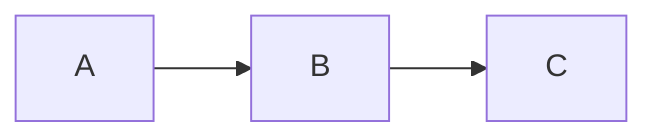

# Slidev FHSH ISIP.hs 通用簡報主題模板

[](https://github.com/cxphoenix/slidev-repo-template/generate)
[](https://sli.dev)
[](https://vuejs.org)
[](https://www.npmjs.com/package/@cxphoenix/slidev-theme-fhsh-isiphs-universal)
[](https://www.npmjs.com/package/@cxphoenix/slidev-addon-python-runner)
[](https://www.npmjs.com/package/slidev-addon-tldraw)
[](http://creativecommons.org/licenses/by/4.0/)

> [!NOTE]
> 專為開發者設計的現代化簡報模板，基於 Slidev 框架，使用 Markdown 語法快速建立專業簡報
> 
> **Version: 1.2.1**

## 📋 目錄

- [專案簡介](#專案簡介)
- [主要特色](#主要特色)
- [快速開始](#快速開始)
- [專案結構](#專案結構)
- [使用指南](#使用指南)
- [主題使用指南](#主題使用指南)
- [Python Runner 使用指南](#python-runner-使用指南)
- [部署方式](#部署方式)
- [開發功能](#開發功能)
- [進階使用](#進階使用)
- [故障排除](#故障排除)
- [參考資源](#參考資源)
- [CHANGELOG](#changelog)

## 📖 專案簡介

這是一個基於 **Slidev** 的簡報模板專案，專為需要建立技術簡報的開發者設計。Slidev 是一個為開發者量身打造的簡報製作工具，使用 Markdown 語法撰寫內容，支援 Vue.js 元件、程式碼高亮、即時預覽等豐富功能。

### 什麼是 Slidev？

Slidev (slide + dev) 是一個基於 Web 的簡報製作與演示工具，具有以下核心優勢：

- **🎯 開發者友善**：使用 Markdown 語法，支援 Git 版本控制
- **⚡ 即時預覽**：基於 Vite 的快速熱重載功能
- **🎨 高度客製化**：支援自訂主題和 Vue.js 元件
- **📊 互動式內容**：內建程式碼編輯器、圖表、動畫效果
- **📤 多格式匯出**：支援 PDF、PPTX、PNG 及 SPA 格式
- **🎥 內建錄製**：支援畫面錄製與相機功能

## ✨ 主要特色

### 🚀 部署與開發
- **一鍵部署**：預設 Netlify 和 Vercel 部署設定
- **📦 GitHub Template**：快速複製專案，立即開始使用
- **📱 響應式設計**：適配各種裝置尺寸

### 🎨 專業主題系統
- **雙主題切換**：整合 FHSH AiSP 與 ISIP.hs 兩種風格
- **課程等級顏色編碼**：
  - Level 0 (綠色)：初階課程
  - Level 1 (藍色)：中階課程
  - Level 2 (橘色)：進階課程
- **豐富 Layout 選項**：封面頁、內容頁、區段分隔、圖片展示、互動測驗等
- **自訂元件**：目錄元件 (ToC)、選擇題元件 (MultiChoice)
- **繁體中文最佳化**：針對台灣教學環境優化

### 🐍 互動式程式執行
- **瀏覽器內執行 Python**：無需後端伺服器，使用 Pyodide 技術
- **PyPI 套件支援**：可安裝 numpy、pandas 等常用套件
- **stdin 輸入處理**：支援預定義與動態輸入
- **Judge Mode**：自動化測試與評分系統
- **錯誤處理機制**：完整的錯誤訊息顯示

### 💡 程式碼功能
- **TypeScript 範例**：內建程式碼片段
- **Monaco 編輯器**：支援即時程式碼編輯
- **語法高亮**：Shiki 提供多語言支援

## 🚀 快速開始

### 1. 使用 GitHub Template

點擊 [Use this template](https://github.com/cxphoenix/slidev-repo-template/generate) 按鈕，建立你的專案副本。

### 2. 複製到本地

```bash
git clone https://github.com/你的使用者名稱/你的專案名稱.git
cd 你的專案名稱
```

### 3. 安裝相依套件

```bash
# 推薦使用 pnpm
pnpm install

# 或使用 npm
npm install
```

### 4. 啟動開發伺服器

```bash
pnpm dev
# 或
npm run dev
```

開啟瀏覽器訪問 http://localhost:3030 即可預覽簡報。

## 📁 專案結構

```
├── slides.md              # 簡報內容主檔案
├── package.json           # 專案設定與相依性
├── components/            # 自訂 Vue 元件
│   └── CustomToc.vue     # 自訂目錄元件
├── snippets/             # 程式碼片段
│   └── external.ts       # TypeScript 範例程式碼
├── netlify.toml          # Netlify 部署設定
├── vercel.json           # Vercel 部署設定
└── public/               # 靜態資源目錄
```

### 核心檔案說明

- **`slides.md`**：簡報的主要內容檔案，使用 Markdown 語法撰寫
- **`package.json`**：定義專案相依性和執行腳本
- **`components/`**：存放自訂 Vue 元件，可在簡報中使用
- **`snippets/`**：程式碼片段，可在簡報中引用
- **部署設定檔**：預設的 Netlify 和 Vercel 部署配置

## 📝 使用指南

### 編輯簡報內容

簡報內容主要在 `slides.md` 檔案中編輯：

```markdown
---
theme: '@cxphoenix/slidev-theme-fhsh-isiphs-universal'
title: 你的簡報標題
drawings:
  persist: false
transition: slide-left
mdc: true
---

# 簡報標題

你的簡報內容...

---

## 第二頁

更多內容...
```

### 使用自訂元件

在簡報中使用自訂的 Vue 元件：

```markdown
# 目錄頁面

<ToC />
```

### 引用程式碼片段

```markdown
# 程式碼範例

<<< @/snippets/external.ts#snippet
```

### 基本語法

- **新增投影片**：使用 `---` 分隔每一頁
- **設定佈局**：在每頁開頭使用 `# layout: default`
- **新增動畫**：使用 `v-click` 指令
- **插入圖片**：``

## 🎨 主題使用指南

本專案使用 `@cxphoenix/slidev-theme-fhsh-isiphs-universal` 主題，這是一個專為福興高中資安課程設計的 Slidev 主題，整合了雙主題系統與課程等級顏色編碼。

### 主題特色

#### 🔄 雙主題系統

主題整合了兩種風格：
- **FHSH AiSP**：適合人工智慧與資安實務課程
- **ISIP.hs**：適合資訊安全實務課程

#### 🎯 課程等級顏色編碼

透過 `courseLevel` 參數設定課程難度，系統會自動套用對應顏色：
- **Level 0 (綠色)**：初階課程，適合入門學習
- **Level 1 (藍色)**：中階課程，需要基礎知識
- **Level 2 (橘色)**：進階課程，需要深入理解

### 主題配置

在 `slides.md` 的 frontmatter 中設定：

```markdown
---
theme: '@cxphoenix/slidev-theme-fhsh-isiphs-universal'
themeName: 'fhsh'        # 'fhsh' 或 'isip.hs'
courseLevel: 0           # 0, 1, 或 2
title: 你的課程標題
---
```

### 可用的 Layout

主題提供多種 layout 選項：

#### 1. Cover (封面頁)

```markdown
---
layout: cover
---

# 課程標題
## 副標題
```

#### 2. Default (預設內容頁)

```markdown
---
layout: default
---

# 頁面標題

你的內容...
```

#### 3. Section (區段分隔頁)

```markdown
---
layout: section
---

# 章節標題
```

#### 4. Image (圖片展示)

```markdown
---
layout: image
image: ./path/to/image.jpg
---
```

#### 5. Quiz (互動測驗)

```markdown
---
layout: quiz
---

# 測驗題目

<MultiChoice :options="['選項A', '選項B', '選項C']" :answer="0" />
```

### 自訂元件

#### ToC (目錄元件)

在任何投影片中插入目錄：

```markdown
# 課程大綱

<ToC />
```

#### MultiChoice (選擇題元件)

建立互動式選擇題：

```markdown
<MultiChoice
  :options="['選項1', '選項2', '選項3', '選項4']"
  :answer="2"
/>
```

### 主題切換範例

**使用 FHSH AiSP 主題（初階課程）**：
```markdown
---
theme: '@cxphoenix/slidev-theme-fhsh-isiphs-universal'
themeName: 'fhsh'
courseLevel: 0
---
```

**使用 ISIP.hs 主題（進階課程）**：
```markdown
---
theme: '@cxphoenix/slidev-theme-fhsh-isiphs-universal'
themeName: 'isip.hs'
courseLevel: 2
---
```

## 🐍 Python Runner 使用指南

本專案整合了 `@cxphoenix/slidev-addon-python-runner`，讓你可以在簡報中直接執行 Python 程式碼，無需後端伺服器，完全在瀏覽器中運作。

### 功能特色

- ✅ **瀏覽器內執行**：基於 Pyodide 技術，在瀏覽器中執行真實的 Python 程式碼
- 📦 **PyPI 套件支援**：可安裝並使用 numpy、pandas 等常用套件
- ⌨️ **stdin 輸入處理**：支援 `input()` 函式的兩種輸入方式
- 🎯 **Judge Mode**：自動化測試系統，適合教學與評分
- 🔍 **錯誤處理**：完整的錯誤訊息與 traceback 顯示
- 🚀 **自動載入套件**：從 import 語句自動安裝所需套件

### 基本配置

在 `slides.md` 的 frontmatter 中配置 Python Runner：

```markdown
---
addons:
  - slidev-addon-python-runner

python:
  # 預先安裝的套件
  installs: ["numpy", "pandas", "matplotlib"]

  # 環境設定（所有程式碼執行前都會先執行）
  prelude: |
    import sys
    GREETING = "Hello, Python!"

  # 自動從 import 語句載入套件
  loadPackagesFromImports: true

  # 隱藏棄用警告
  suppressDeprecationWarnings: true
---
```

### 執行程式碼

#### 基本範例

使用 `{monaco-run}` 標記啟用程式碼執行功能：

````markdown
```py {monaco-run}
# 簡單的 Python 程式
print("Hello, Slidev!")
print("2 + 2 =", 2 + 2)
```
````

#### 使用已安裝的套件

````markdown
```python {monaco-run}
import numpy as np
import pandas as pd

# 建立資料框
df = pd.DataFrame({
    "Name": ["Alice", "Bob", "Charlie"],
    "Score": [85, 92, 78]
})

print(df)
print(f"\n平均分數: {df['Score'].mean():.2f}")
```
````

### stdin 輸入處理

Python Runner 支援兩種方式處理 `input()` 函式：

#### 方法 1：在 frontmatter 中預定義

```markdown
---
python:
  stdin:
    - "Alice"
    - "25"
    - "台北"
---

```python {monaco-run}
name = input("請輸入姓名：")
age = input("請輸入年齡：")
city = input("請輸入城市：")

print(f"{name} 今年 {age} 歲，住在 {city}")
```
```

#### 方法 2：在程式碼註解中指定

````markdown
```python {monaco-run}
# stdin: "Bob"
# stdin: "30"
# stdin: "高雄"

name = input("請輸入姓名：")
age = input("請輸入年齡：")
city = input("請輸入城市：")

print(f"{name} 今年 {age} 歲，住在 {city}")
```
````

### Judge Mode（評分模式）

Judge Mode 可以自動執行測試案例並比對輸出結果，適合作業評分與自我練習。

測試資料請放在 `/public/{python.judge.dir || judge}/{inputs,outputs}/*.{in,out}` 中，

`python.judge.dir` 預設為 `judge`；

`.in` 跟 `.out` 並非必要副檔名，但需要注意順序必須對應。

#### 設定測試案例

```markdown
---
python:
  judge:
    dir: "judge"
    inputs:
      - 1.in
      - 2.in
    outputs:
      - 1.out
      - 2.out
---

```python {monaco-run}
# 請寫一個程式，讀取兩個數字並輸出其和
a = int(input())
b = int(input())
print(a + b)
```
```

測試結果會顯示：
- ✅ **AC (Accepted)**：輸出正確
- ❌ **NA (Not Accepted)**：輸出不符預期

### 套件安裝

#### 預先安裝

在 frontmatter 中列出需要的套件：

```markdown
---
python:
  installs:
    - "numpy"
    - "pandas"
    - "matplotlib"
    - "scikit-learn"
---
```

#### 自動安裝

啟用 `loadPackagesFromImports` 後，套件會在首次執行時自動安裝：

```markdown
---
python:
  loadPackagesFromImports: true
---

```python {monaco-run}
import requests  # 會自動安裝 requests
response = requests.get("https://api.github.com")
print(response.status_code)
```
```

### 進階配置選項

```markdown
---
python:
  # 套件安裝
  installs: ["numpy", "pandas"]

  # 環境初始化
  prelude: |
    import sys
    import os
    DEBUG = True

  # 自動載入功能
  loadPackagesFromImports: true

  # 隱藏警告訊息
  suppressDeprecationWarnings: true

  # stdin 輸入（全域設定）
  stdin:
    - "input1"
    - "input2"

  # Judge 測試案例
  judge:
    - input: "test input"
      output: "expected output"
---
```

### 實用範例

#### 資料分析範例

````markdown
```python {monaco-run}
import pandas as pd
import numpy as np

# 建立銷售資料
data = {
    '月份': ['1月', '2月', '3月', '4月'],
    '銷售額': [12000, 15000, 13500, 18000]
}
df = pd.DataFrame(data)

print("銷售報表")
print("=" * 30)
print(df)
print(f"\n總銷售額: ${df['銷售額'].sum():,}")
print(f"平均銷售額: ${df['銷售額'].mean():,.0f}")
print(f"最高銷售額: ${df['銷售額'].max():,} ({df.loc[df['銷售額'].idxmax(), '月份']})")
```
````

#### 演算法教學範例

````markdown
```python {monaco-run}
# stdin: "5"
# 計算階乘

def factorial(n):
    if n <= 1:
        return 1
    return n * factorial(n - 1)

n = int(input("請輸入數字: "))
result = factorial(n)
print(f"{n}! = {result}")
```
````

### 注意事項

- 🌐 **網路限制**：某些網路操作可能受限於瀏覽器安全政策
- 📦 **套件相容性**：並非所有 Python 套件都支援 Pyodide，請參考 [Pyodide 套件清單](https://pyodide.org/en/stable/usage/packages-in-pyodide.html)
- ⚡ **效能考量**：首次載入 Pyodide 需要一些時間，建議預先安裝常用套件
- 💾 **檔案系統**：檔案操作在虛擬檔案系統中進行，重新整理後會重置

## 🌐 部署方式

### GitHub Pages

1. 在 repository 的 Settings > Pages
2. 選擇 "GitHub Actions" 作為 source
3. 推送程式碼後自動部署到 `https://你的使用者名稱.github.io/專案名稱/`

### Netlify 部署

1. 連接你的 GitHub repository
2. 專案會自動讀取 `netlify.toml` 設定檔
3. 構建命令：`npm run build`
4. 發布目錄：`dist`

### Vercel 部署

1. 匯入 GitHub repository
2. 專案會自動讀取 `vercel.json` 設定檔
3. 一鍵部署，支援自動 CI/CD

### 手動構建

```bash
# 構建靜態檔案
pnpm build

# 構建後的檔案位於 dist/ 目錄
# 可部署到任何靜態檔案伺服器
```

## 🛠️ 開發功能

### 即時預覽

開發模式下支援即時預覽，修改 `slides.md` 後瀏覽器會自動重新載入。

```bash
pnpm dev --open  # 自動開啟瀏覽器
```

### 程式碼高亮

支援多種程式語言的語法高亮：

````markdown
```typescript
function hello(name: string): string {
  return `Hello, ${name}!`
}
```
````

### 數學公式

支援 LaTeX 數學公式：

```markdown
$$
\sum_{i=1}^{n} x_i = x_1 + x_2 + \cdots + x_n
$$
```

### 圖表支援

支援 Mermaid 圖表：

````markdown

````

### 互動式程式碼執行

#### Python 程式碼

使用 `{monaco-run}` 標記執行 Python 程式碼：

````markdown
```python {monaco-run}
# 直接在簡報中執行 Python
import math

radius = 5
area = math.pi * radius ** 2
print(f"半徑 {radius} 的圓面積為 {area:.2f}")
```
````

#### TypeScript/JavaScript

````markdown
```typescript {monaco-run}
// 執行 TypeScript 程式碼
const numbers = [1, 2, 3, 4, 5];
const sum = numbers.reduce((a, b) => a + b, 0);
console.log(`總和: ${sum}`);
```
````

### 互動式元件

#### 選擇題測驗

````markdown
# 快速測驗

<MultiChoice
  :options="['HTML', 'Python', 'CSS', 'JavaScript']"
  :answer="1"
/>

請問哪個是後端程式語言？
````

#### 目錄導航

````markdown
# 課程大綱

<ToC />
````

#### TLDraw 白板

支援即時繪圖與標註（透過 slidev-addon-tldraw）：

````markdown
# 系統架構圖

<TLDraw />
````

## 📈 進階使用

### 自訂主題

修改 frontmatter 中的主題設定：

```markdown
---
theme: '@cxphoenix/slidev-theme-fhsh-isiphs-universal'
# 其他主題選項...
---
```

### 建立自訂元件

在 `components/` 目錄下建立新的 Vue 元件：

```vue
<!-- components/MyComponent.vue -->
<template>
  <div class="my-component">
    <h2>{{ title }}</h2>
  </div>
</template>

<script setup>
defineProps({
  title: String
})
</script>
```

### 匯出功能

```bash
# 匯出為 PDF
pnpm export

# 匯出為 PNG (每頁一張)
pnpm export --format png

# 匯出為 PPTX
pnpm export --format pptx
```

### 簡報者模式

在瀏覽器中按 `?` 鍵檢視所有快捷鍵，包括：

- `f`：全螢幕模式
- `o`：總覽模式
- `d`：暗黑模式切換
- `g`：跳轉到指定頁面

## 🔧 故障排除

### 常見問題

**Q: 安裝相依套件時出現錯誤**
```bash
# 清除 node_modules 並重新安裝
rm -rf node_modules package-lock.json
npm install
```

**Q: 開發伺服器無法啟動**
- 確保 Node.js 版本 ≥ 18.0
- 檢查 3030 port 是否被占用

**Q: 部署後樣式錯誤**
- 確認 base path 設定正確
- 檢查靜態資源路徑

### 系統需求

- **Node.js**: ≥ 18.0
- **套件管理器**: npm、pnpm、或 yarn
- **瀏覽器**: 支援現代 Web 標準的瀏覽器

### 除錯模式

```bash
# 以除錯模式啟動
DEBUG=slidev* pnpm dev
```

## 📚 參考資源

### 官方文件

- [Slidev 官方網站](https://sli.dev)
- [Slidev 文件](https://sli.dev/guide/)
- [主題畫廊](https://sli.dev/resources/theme-gallery)

### 相關套件

- [Vue.js](https://vuejs.org) - 前端框架
- [Vite](https://vitejs.dev) - 構建工具
- [UnoCSS](https://unocss.dev) - CSS 引擎
- [Shiki](https://shiki.style) - 程式碼高亮

### 學習資源

- [Markdown 語法指南](https://www.markdownguide.org)
- [Vue.js 官方教學](https://vuejs.org/tutorial/)
- [Slidev 範例集](https://github.com/slidevjs/slidev/tree/main/demo)

---

## 📝 CHANGELOG

### Version 1.2.0 (2025-09-30)

#### 🎨 專案重構
- ✨ 專案名稱更新：從 `slidev-aisp-template` 更名為 `slidev-fhsh-isiphs-template`
- 🏷️ 新增版本號 `1.2.0`

#### 📦 依賴套件更新

**🔄 主題套件變更**
- 🔄 從 `@cxphoenix/slidev-theme-fhsh-aisp@1.2.0` 更換為 `@cxphoenix/slidev-theme-fhsh-isiphs-universal@1.0.1`
- 💡 採用全新的 ISiPHS Universal 主題系統

**⬆️ 套件升級**
- ⬆️ `@slidev/cli`: `52.1.0` → `52.2.4`
- ⬆️ `vue`: `3.5.18` → `3.5.22`
- ⬆️ `playwright-chromium`: `1.55.0` → `1.55.1`

**⬇️ 套件降級**
- ⬇️ `@cxphoenix/slidev-addon-python-runner`: `1.0.0` → `0.5.0`
  - 配合新主題系統調整版本

**🔒 版本鎖定**
- 📌 所有依賴改為精確版本（移除 `^` 符號）
- 🎯 確保建置環境一致性

**🗑️ 移除不需要的套件**
- ❌ 移除 `@slidev/theme-default`
- ❌ 移除 `@slidev/theme-seriph`

#### 🧹 檔案清理
- 🗑️ 刪除 `public/fonts/edukai-5.0.ttf` 字型檔案
- 🗑️ 刪除 `styles/index.css` 樣式檔案
- ✨ 新增 `styles/.gitkeep` 保留目錄結構

#### ⚡ 套件管理器
- 📈 pnpm lockfile 格式從 `6.0` 升級至 `9.0`
- 🔧 改善依賴管理效能

#### 📚 文件更新
- 📖 更新 README.md 中所有主題引用
- 🏷️ 更新 Badges 版本資訊
- ✏️ 修正專案名稱和描述

---

## 📄 授權條款

本專案採用創用 CC 授權條款，詳見 [LICENSE](./LICENSE) 檔案。

## 🤝 貢獻

歡迎提交 Issue 和 Pull Request 來改善這個模板！

1. Fork 這個專案
2. 建立你的功能分支 (`git checkout -b feature/AmazingFeature`)
3. 提交你的修改 (`git commit -m 'Add some AmazingFeature'`)
4. 推送到分支 (`git push origin feature/AmazingFeature`)
5. 開啟一個 Pull Request

---

**🎯 讓我們一起用 Slidev 建立更棒的簡報！**